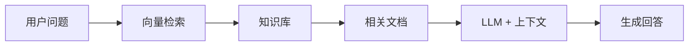

## 什么是 RAG

RAG（Retrieval-Augmented Generation）是一种结合检索和生成的 AI 架构模式。它的核心思想是：

> 在 LLM 生成回答之前，先从外部知识库中检索相关信息，作为上下文提供给模型。



## 为什么需要 RAG

纯 LLM 存在几个关键局限：

1. **知识截止日期** — 模型训练数据有截止时间
2. **幻觉问题** — 模型可能编造不存在的事实
3. **领域知识缺失** — 通用模型缺少专业领域知识
4. **不可溯源** — 无法确认信息来源

RAG 通过注入外部知识，有效缓解了这些问题。

## 核心组件

### 1. 文档处理

```python
from langchain.text_splitter import RecursiveCharacterTextSplitter

splitter = RecursiveCharacterTextSplitter(
    chunk_size=1000,
    chunk_overlap=200,
)
chunks = splitter.split_documents(documents)
```

分块策略很重要——太大则检索精度下降，太小则丢失上下文。

### 2. 向量化与存储

```python
from langchain.embeddings import OpenAIEmbeddings
from langchain.vectorstores import Chroma

embeddings = OpenAIEmbeddings()
vectorstore = Chroma.from_documents(
    documents=chunks,
    embedding=embeddings,
    persist_directory="./chroma_db"
)
```

### 3. 检索链

```python
from langchain.chains import RetrievalQA

qa_chain = RetrievalQA.from_chain_type(
    llm=llm,
    chain_type="stuff",
    retriever=vectorstore.as_retriever(
        search_kwargs={"k": 4}
    )
)

result = qa_chain.run("什么是 RAG 的核心优势？")
```

## 最佳实践

1. **Chunk Size 调优** — 根据内容类型调整分块大小
2. **元数据过滤** — 利用文档元数据缩小检索范围
3. **Re-ranking** — 对检索结果二次排序提升相关性
4. **引用标注** — 在回答中标注信息来源

## 下一步

下一篇将探讨如何用 `PgVector` 替代 Chroma，在生产环境中构建可扩展的 RAG 管线。
